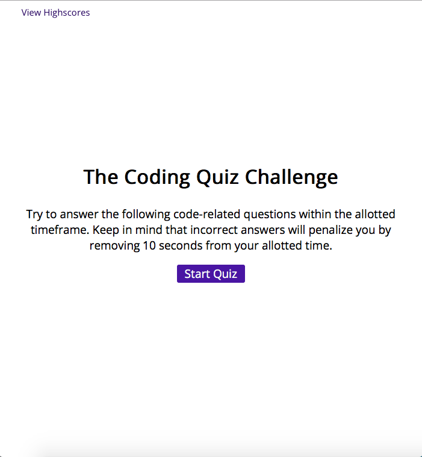
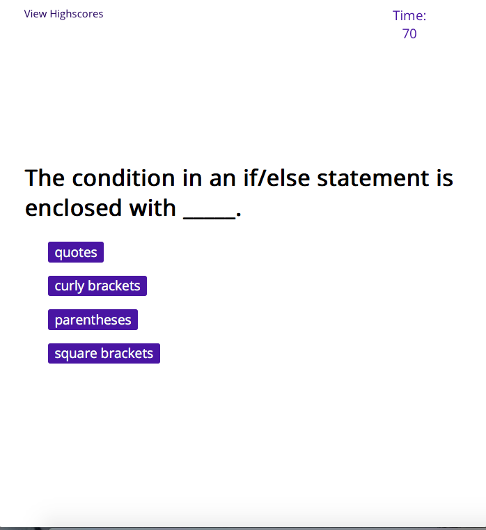
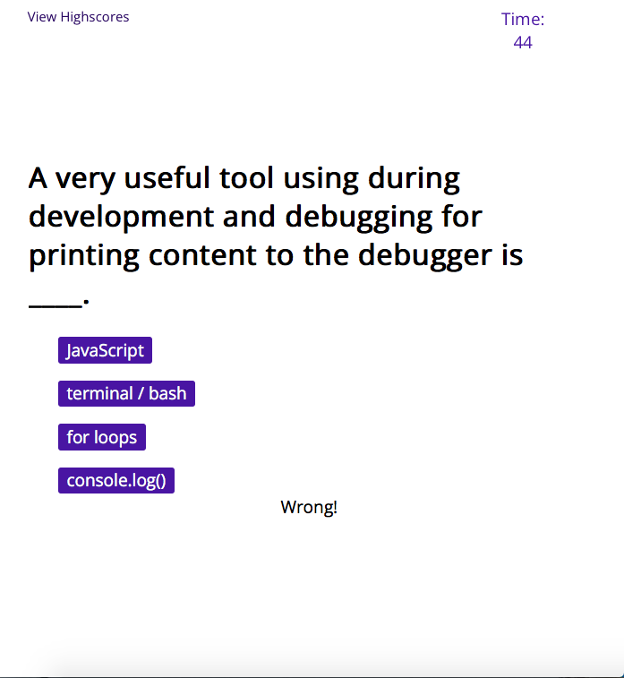
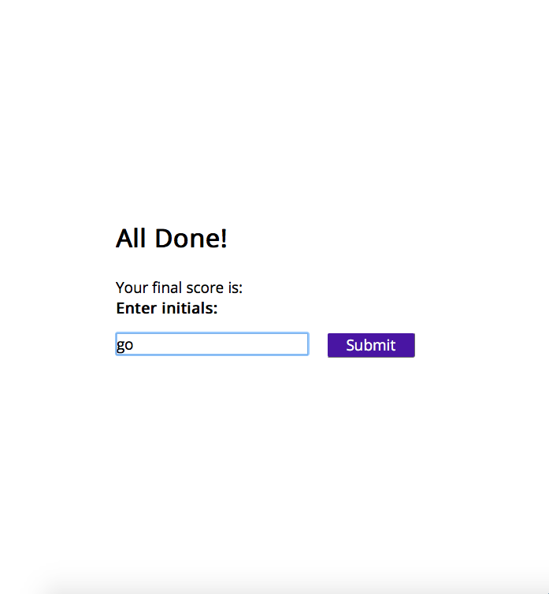
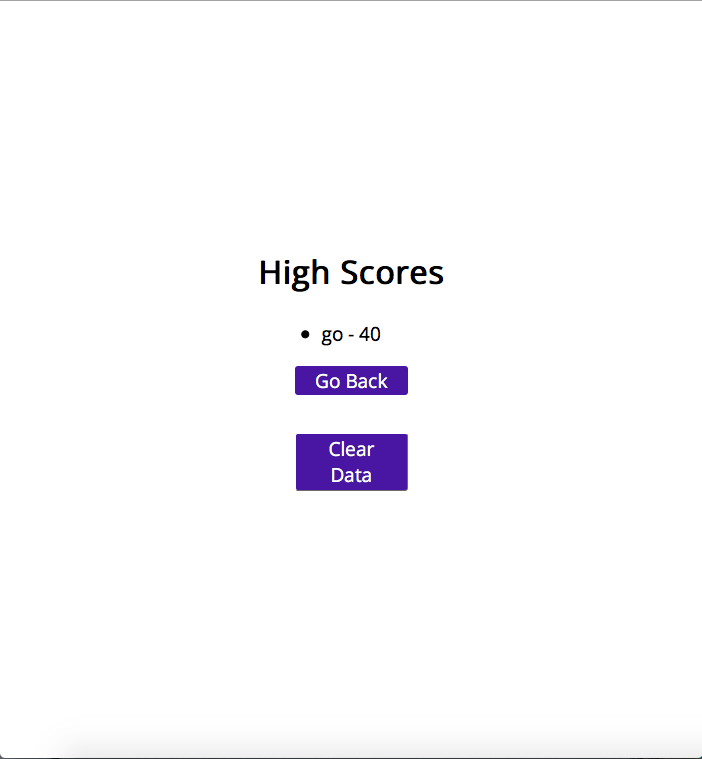

# Interactive JavaScript Quiz

## Description

This coding quiz was designed for students to practice their JavaScript knowledge. It deploys a message, letting the user know if they choose correctly or incorrectly. If they choose incorrectly, they are penalized seconds from the timer. At the end, there is a form for the user to enter their initials and save their score. Finally, they can see their score and initials displayed on the high score page. 

## User Story

```
AS A coding boot camp student
I WANT to take a timed quiz on JavaScript fundamentals that stores high scores
SO THAT I can gauge my progress compared to my peers
```

## Acceptance Criteria

```
GIVEN I am taking a code quiz
WHEN I click the start button
THEN a timer starts and I am presented with a question
WHEN I answer a question
THEN I am presented with another question
WHEN I answer a question incorrectly
THEN time is subtracted from the clock
WHEN all questions are answered or the timer reaches 0
THEN the game is over
WHEN the game is over
THEN I can save my initials and my score
```

## Mock-Up

The following screenshots demonstrates the application functionality:











## Link to Deployed Site


---

© 2022 edX Boot Camps LLC. Confidential and Proprietary. All Rights Reserved.
